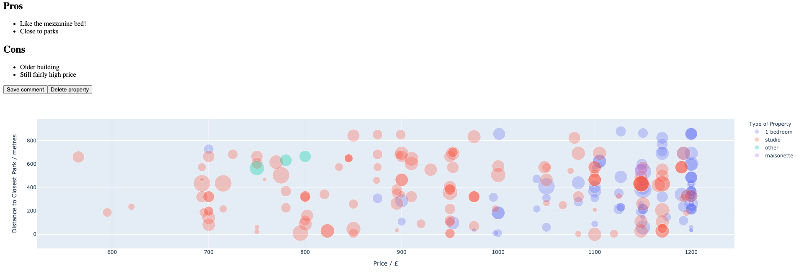

# Project Dolphin <!-- omit in toc -->

- [1. How to use this repo](#1-how-to-use-this-repo)
- [2. Refactoring 🏗️](#2-refactoring-️)
- [3. Functionality](#3-functionality)
  - [3.1. Currently Implemented](#31-currently-implemented)
  - [3.2. Still to be refactored from previous version](#32-still-to-be-refactored-from-previous-version)
  - [3.3. Future development](#33-future-development)
- [4. UI](#4-ui)
  - [4.1. Implemented functionality](#41-implemented-functionality)
  - [4.2. In development](#42-in-development)


## 1. How to use this repo

To build the containers, you must first create a `database.env` file in the template specified by [`example_database.env`](example_database.env).

Following this, the containers can be built using:

```bash
docker-compose up -d
```


To fetch POIs and road network, run (ideally in the container `dolphin-server` - you can get into the container using `docker exec -it dolpin-server /bin/bash`):
1. [STATIC-01.0-query-osmnx.ipynb](notebooks/STATIC-01.0-query-osmnx.ipynb)
2. [STATIC-02-save-roadnet-coords.ipynb](notebooks/STATIC-02.0-save-roadnet-coords.ipynb)
3. [STATIC-03.0-snap-pois-roadnet.ipynb](notebooks/STATIC-03.0-snap-pois-roadnet.ipynb)

To run the full processing (currently with a standard search), run:

```bash
sh run_processing.sh -s <yoursearchname>
```


## 2. Refactoring 🏗️

NOTE: this repo is a refactored version of a faster (but less robust) initial implementation. Some of the functionality from the old repo has not yet been incorporated.

## 3. Functionality

<details>
    <summary> Show/Hide Details</summary>


### 3.1. Currently Implemented

This repo carries out the following on each update:
1. Scrape properties from RightMove
2. Cross-reference against currently processed properties to minimise computation
3. Geocode properties
4. Convert to bng coordinates for measurements in metres
5. Finds closest of each type of point of interest (POI) eg. tube stations, parks
6. Finds distances to these POIs along the road network

### 3.2. Still to be refactored from previous version

* Incorporating custom points of interest (POIs) eg. location of friends

### 3.3. Future development

* Improve scraping to gather more data
  * Facilities in the flat
  * Square footage
  * Number of bathrooms
  * Furnished vs. unfurnished
  * Broadband speed
* Schedule processing with airflow


</details>

## 4. UI

<details>
    <summary> Show/Hide Details</summary>

The current version of this repo is being refactored 🏗️, so the code for generating the dashboard is not yet published.

Attached below are screenshots of the user interface in the original version (the one that I used to find my current flat!).

### 4.1. Implemented functionality

* Choosing properties to view (and display url)
* Markdown commenting which will save to the database
* Viewing properties on a map
* Marking properties as favourites
    * You can also filter to only include favourited properties


### 4.2. In development

* Fully customiseable bubble plots, with variables specified by user
  * Can be distances from user-specified POIs or other useful metrics

</details>



